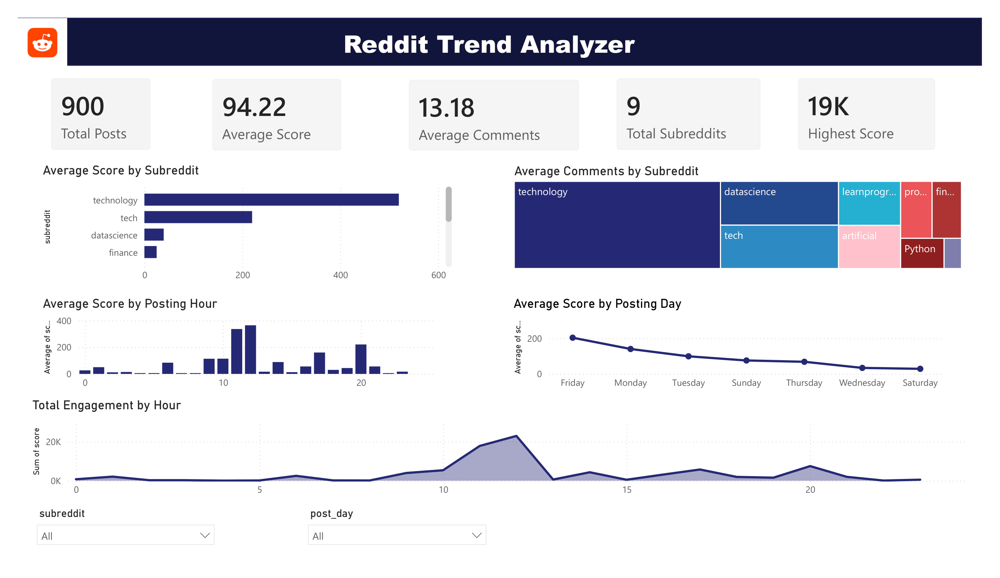

# Reddit-Trend-Analyzer

An end-to-end Data Analytics project that collects Reddit data, performs data cleaning and exploratory data analysis (EDA) using Python, analyzes the data with SQL, and visualizes key insights through an interactive Power BI dashboard.

---

## 📌 Project Overview

This project analyzes Reddit posts from multiple technology-related subreddits to uncover engagement patterns and posting trends.

The workflow includes:

- Data Collection
- Data Cleaning
- Exploratory Data Analysis (EDA)
- SQL Analysis
- Interactive Power BI Dashboard

---

## 🎯 Objectives

- Collect Reddit posts from multiple subreddits
- Clean and preprocess the dataset
- Perform exploratory data analysis using Python
- Answer business questions using SQL
- Build an interactive Power BI dashboard
- Generate actionable insights about Reddit engagement

---

## 🛠️ Tools & Technologies

- Python
- Pandas
- NumPy
- Matplotlib
- MySQL
- Power BI
- PullPush API (Reddit Data Collection)

---

## 📂 Project Structure

```
Reddit-Trend-Analyzer
│
├── data
│   ├── reddit_data.csv
│   └── reddit_data_clean.csv
│
├── python
│   ├── analysis_day_vs_score.py
│   ├── analysis_hour_vs_score.py
│   ├── analysis_length_vs_score.py
│   ├── analysis_score_vs_comments.py
│   ├── analysis_subreddit_vs_avg_comments.py
│   ├── analysis_subreddit_vs_avg_score.py
│   ├── analysis_title_length_vs_no_of_post.py
│   └── analysis_viral_posts.py
│
├── sql
│   └── reddit_analysis.sql
│
├── powerbi
│   └── reddit_trend_analyzer.pbix
│
├── dashboard.png
├── README.md
└── requirements.txt
```

---

# 📊 Exploratory Data Analysis (Python)

The following analyses were performed:

- Average Score by Subreddit
- Average Comments by Subreddit
- Average Score by Posting Hour
- Average Score by Posting Day
- Top Viral Reddit Posts
- Distribution of Title Length
- Title Length vs Score
- Score vs Comments

---

# 🗄 SQL Analysis

Business questions answered using MySQL:

- Total number of Reddit posts
- Average score by subreddit
- Average comments by subreddit
- Best posting hour
- Best posting day
- Most active authors
- Highest commented posts
- Highest scoring posts
- Post distribution across subreddits

---

# 📈 Power BI Dashboard

The interactive dashboard includes:

- Total Posts KPI
- Average Score KPI
- Average Comments KPI
- Total Subreddits KPI
- Highest Score KPI
- Average Score by Subreddit
- Average Comments by Subreddit
- Average Score by Posting Hour
- Average Score by Posting Day
- Total Engagement by Posting Hour
- Interactive Filters (Subreddit & Posting Day)

---

## 📷 Dashboard Preview

> Replace this image with your exported dashboard screenshot.



---

# 📌 Key Insights

- Identified the highest-performing subreddit based on average post score.
- Determined the best hour to post for maximum engagement.
- Compared average comments across different subreddits.
- Analyzed engagement trends across different days of the week.
- Built an interactive dashboard for dynamic filtering and exploration.

---

# 🚀 How to Run

## 1. Clone the repository

```bash
git clone https://github.com/yourusername/Reddit-Trend-Analyzer.git
```

---

## 2. Install dependencies

```bash
pip install -r requirements.txt
```

---

## 3. Run Python analysis

Execute the required Python scripts inside the `python` folder.

---

## 4. SQL Analysis

Import `reddit_data_clean.csv` into MySQL and execute the queries in:

```
sql/reddit_analysis.sql
```

---

## 5. Open Power BI Dashboard

Open:

```
powerbi/reddit_trend_analyzer.pbix
```

---

# 📊 Skills Demonstrated

- Data Collection
- Data Cleaning
- Exploratory Data Analysis
- Data Visualization
- SQL Query Writing
- Dashboard Development
- Business Insight Generation

---

# 📄 Future Improvements

- Collect larger Reddit datasets
- Automate daily data collection
- Perform Sentiment Analysis on post titles
- Add NLP-based keyword extraction
- Deploy the dashboard using Power BI Service

---

# 👨‍💻 Author

**Sarthak Mandal**

Data Analyst | Python | SQL | Power BI

---

⭐ If you found this project useful, consider giving it a star!
